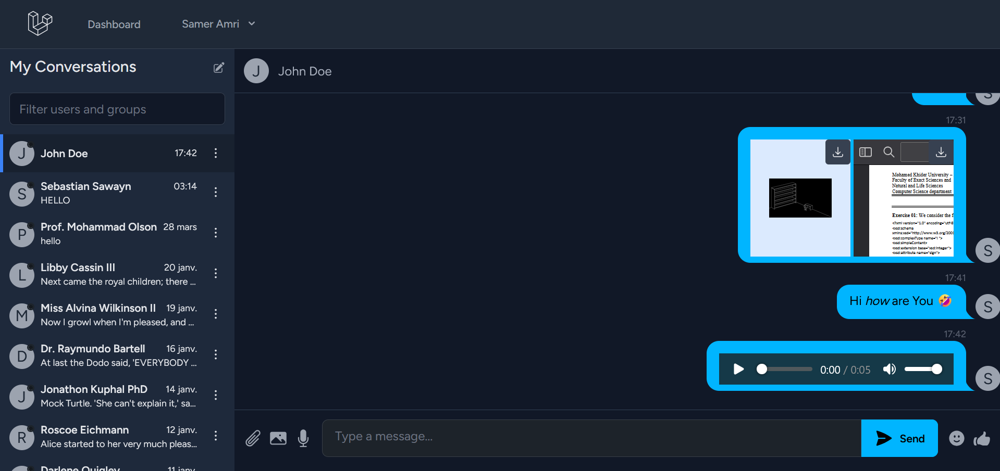

# Chat System

## Description

A real-time chat application built as a learning project to explore modern web development technologies. This repository showcases the integration of **Laravel** (PHP framework) for the backend API and authentication, **React** for a dynamic and responsive frontend, and **Laravel Reverb** for real-time WebSocket communication. The project aims to implement core chat functionalities such as user messaging, online status updates, and message broadcasting, providing hands-on experience with full-stack development, event-driven architecture, and real-time features in a Laravel-React ecosystem.

## Technologies Used

- **Laravel**: Backend framework for API development, routing, and user management.
- **React**: Frontend library for building an interactive user interface.
- **Laravel Reverb**: WebSocket server for real-time bi-directional communication.
- **Laravel Breeze**: Authentication scaffolding for quick setup of login and registration features.
- **MySQL**: Database for storing users and messages (configurable via `.env`).

## Learning Goals

- Master Laravel’s backend capabilities, including Eloquent ORM and broadcasting.
- Gain proficiency in React for state management and component-based UI design.
- Understand real-time application development with WebSockets using Laravel Reverb.
- Explore the integration of frontend and backend in a full-stack application.

## Status

Work in progress – currently learning and implementing features like user authentication, real-time messaging, and UI enhancements.

## Tools and Versions Required

To run this project, ensure you have the following tools installed with compatible versions:

### Backend (PHP/Laravel)
- **PHP**: `^8.2`
- **Laravel Framework**: `^11.31`
- **Laravel Reverb**: `^1.0`
- **Laravel Breeze**: `^2.3` (for authentication scaffolding)
- **Composer**: Latest stable version (for dependency management)
- Additional PHP packages:
    - `inertiajs/inertia-laravel`: `^2.0` (for React integration)
    - `laravel/sanctum`: `^4.0` (for API authentication)
    - `laravel/tinker`: `^2.9` (for interactive shell)
    - `tightenco/ziggy`: `^2.0` (for Laravel routes in JavaScript)

### Frontend (React)
- **Node.js**: `^18.x` or `^20.x` (recommended for Vite compatibility)
- **npm**: Latest stable version (for package management)
- **React**: `^18.2.0`
- **React DOM**: `^18.2.0`
- **Vite**: `^6.0` (bundler for React)
- Additional frontend packages:
    - `laravel-echo`: `^1.19.0` (for WebSocket client)
    - `pusher-js`: `^8.4.0-rc2` (WebSocket client library for Reverb)
    - `@inertiajs/react`: `^2.0.0` (Inertia.js adapter for React)
    - `tailwindcss`: `^3.2.1` (CSS framework)
    - `daisyui`: `^4.12.23` (Tailwind CSS component library)

### Database
- **MySQL**: `^5.7` or `^8.0` (or another Laravel-supported database like SQLite)

### Development Tools
- **Laravel Sail**: `^1.26` (optional, for Docker-based development environment)
- **Pest**: `^3.7` (testing framework)
- **Laravel Pint**: `^1.13` (code style fixer)

## How to Set Up the Project

Follow these steps to set up and run the project locally:

### Prerequisites
1. Install **PHP 8.2+** and **Composer** ([Composer Installation Guide](https://getcomposer.org/download/)).
2. Install **Node.js 18+** and **npm** ([Node.js Installation Guide](https://nodejs.org/)).
3. Ensure **MySQL** is installed and running (or use SQLite by creating `database/database.sqlite`).

# Chat System Installation Guide

## Installation Steps

### 1. Clone the Repository & Navigate to the Project Directory
```bash
cd chat-system
```

### 2. Install PHP Dependencies
```bash
composer install
```

### 3. Install JavaScript Dependencies
```bash
npm install
```

### 4. Set Up Environment File

#### Copy the example environment file:
```bash
cp .env.example .env
```

#### Edit `.env` to configure your database and Reverb settings:
```env
DB_CONNECTION=mysql
DB_HOST=127.0.0.1
DB_PORT=3306
DB_DATABASE=chat_system
DB_USERNAME=root
DB_PASSWORD=

REVERB_APP_ID=chat-system
REVERB_APP_KEY=your-key-here
REVERB_APP_SECRET=your-secret-here
REVERB_HOST=localhost
REVERB_PORT=8080
REVERB_SCHEME=http
```

### 5. Generate Application Key
```bash
php artisan key:generate
```

### 6. Install Breeze (Authentication Scaffolding)
Run the Breeze installation command and choose the React stack:
```bash
php artisan breeze:install react
```
This sets up authentication views, routes, and controllers with Inertia.js and React.

### 7. Run Database Migrations
```bash
php artisan migrate
```

### 8. Start the Laravel Development Server
```bash
php artisan serve
```

### 9. Start Laravel Reverb (WebSocket Server)
```bash
php artisan reverb:start
```

### 10. Start the Vite Development Server (React)
In a separate terminal:
```bash
npm run dev
```

## Access the Application
Open your browser and go to:
```
http://localhost:8000
```


## Screenshots

Below are some screenshots of the Chat System in action, showcasing the login page and the real-time chat interface.

### Login Page
The login page allows users to authenticate using their email and password, powered by Laravel Breeze for secure authentication.


### Chat Interface
The chat interface displays a list of conversations on the left and the selected conversation on the right. It supports real-time messaging using Laravel Reverb for WebSocket communication.



